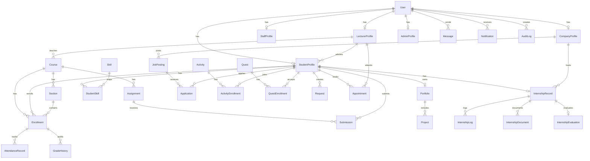

# Database Schema Guide

เอกสารนี้อธิบายโครงสร้างฐานข้อมูลของ DII CAMT ShowProGroup สำหรับ developer, frontend/backend team, และ AI/Agent ที่ต้องเข้ามาแก้ระบบต่อ

แหล่งข้อมูลจริงของ schema คือ `backend/prisma/schema.prisma` ถ้าเอกสารนี้ขัดกับ Prisma schema ให้ยึด `schema.prisma` เป็นหลัก

## สำหรับ AI/Agent ที่เข้ามาทำงาน

ก่อนแก้ database, API, service, seed, หรือ frontend data mapping ให้อ่านส่วนนี้ก่อน

### สิ่งที่ต้องเข้าใจทันที

- Database ใช้ PostgreSQL ผ่าน Prisma ORM
- Prisma schema อยู่ที่ `backend/prisma/schema.prisma`
- Prisma client singleton อยู่ที่ `backend/src/lib/prisma.ts`
- Seed data อยู่ที่ `backend/prisma/seed.ts`
- API route แบ่งตาม domain ใน `backend/src/routes/*`
- Business logic หลักอยู่ใน `backend/src/services/*`
- Frontend mapping อยู่ที่ `src/lib/live-mappers.ts` และ data bridge อยู่ที่ `src/lib/backend-data-bridge.ts`

### กฎสำคัญก่อนแก้ schema

- อย่าเปลี่ยนชื่อ model/field ที่ frontend หรือ route ใช้อยู่แล้วโดยไม่ตรวจ usage ด้วย `rg`
- ถ้าเพิ่ม relation ต้องคิดเรื่อง cardinality ให้ชัด: one-to-one, one-to-many, many-to-many through join model
- ถ้าเพิ่ม field ที่ frontend ต้องใช้ ให้เพิ่ม mapping ใน `src/lib/live-mappers.ts` หรือ API response ที่เกี่ยวข้องด้วย
- ถ้าเพิ่ม enum หรือ status ใหม่ ให้ตรวจ frontend badge/filter/status text ด้วย
- ถ้าแก้ unique constraint ให้ตรวจ seed และ service logic ที่สร้างข้อมูลซ้ำ
- ถ้าเป็น production migration ควรใช้ Prisma migrate ไม่ใช่ `db push`
- อย่าแก้ seed ให้ผ่านเฉพาะเคสเดียวโดยทำลาย demo accounts หรือ demo workflows

### Command ที่เกี่ยวข้อง

จาก root project:

```bash
npm run backend:generate
npm run backend:push
npm run backend:seed
npm run backend:validate
```

จาก `backend/`:

```bash
npm run prisma:generate
npm run prisma:push
npm run prisma:seed
npm run validate
```

## ภาพรวม Database

ระบบนี้เป็น role-based academic management platform มี 5 กลุ่มผู้ใช้หลัก:

- `STUDENT`
- `LECTURER`
- `STAFF`
- `COMPANY`
- `ADMIN`

แกนหลักของข้อมูลคือ `User` แล้วต่อออกไปเป็น profile ตาม role:

- `StudentProfile`
- `LecturerProfile`
- `StaffProfile`
- `CompanyProfile`
- `AdminProfile`

จาก profile แต่ละแบบ ระบบจะเชื่อมไปยัง module ต่าง ๆ เช่น course, enrollment, internship, activity, quest, request, appointment, message, notification และ audit log

## Conventions

### Primary Key

เกือบทุกตารางใช้:

```prisma
id String @id @default(cuid())
```

หมายความว่า id เป็น string แบบ CUID ที่ Prisma สร้างให้

### Timestamp

Pattern ที่ใช้บ่อย:

```prisma
createdAt DateTime @default(now())
updatedAt DateTime @updatedAt
```

บางตารางมีเฉพาะ `createdAt` หรือ timestamp เฉพาะ domain เช่น `submittedAt`, `appliedAt`, `checkedInAt`

### Status Fields

หลายตารางใช้ `String` สำหรับ status แทน enum เช่น:

- `academicStatus`
- `status`
- `subscriptionStatus`
- `onboardingStatus`
- `registrationStatus`

ข้อควรระวัง: ก่อนเพิ่มค่า status ใหม่ ให้ตรวจ frontend filter, badge, translation และ service logic เพราะ TypeScript จะไม่ช่วยเช็กเหมือน enum

### Array และ JSON

Schema ใช้ PostgreSQL array และ JSON หลายจุด:

- `String[]`: permissions, skills, prerequisites, requirements, completedTasks
- `Json`: schedule, attachments, changes, metadata, trigger/action ของ automation

ควรใช้ structured object ชัดเจนใน service layer และ validate ด้วย Zod ใน route ถ้าเป็น input จาก user

## High-Level ER Diagram



## Domain Map

### 1. Identity และ Role Profiles

| Model | ใช้ทำอะไร | Relation สำคัญ |
|---|---|---|
| `User` | account กลางสำหรับ login, role, profile, message, notification | one-to-one กับ role profile, one-to-many กับ messages/files/logs |
| `StudentProfile` | ข้อมูลนักศึกษา, academic status, gamification, portfolio, internship | belongs to `User`, มี enrollments, activities, quests, requests |
| `LecturerProfile` | ข้อมูลอาจารย์, รายวิชาที่สอน, advisees, office hours | belongs to `User`, teaches `Course`, advises students |
| `StaffProfile` | ข้อมูลเจ้าหน้าที่และ permission flags | belongs to `User` |
| `CompanyProfile` | ข้อมูลบริษัท, subscription, partner/onboarding, job postings | belongs to `User`, has jobs/interns/cooperation/payments |
| `AdminProfile` | ข้อมูล admin/super admin และ automation ownership | belongs to `User`, owns `AutomationRule` |

### User

ศูนย์กลางของระบบ authentication และ authorization

Field สำคัญ:

- `email` unique ใช้ login
- `passwordHash` เก็บ hashed password
- `role` เป็น enum `Role`
- `isActive` ใช้ปิด account
- `lastLogin` ใช้ audit/session display
- relation ไปยัง `studentProfile`, `lecturerProfile`, `staffProfile`, `companyProfile`, `adminProfile`

ข้อควรระวัง:

- `User.role` ควรสอดคล้องกับ profile ที่มีอยู่จริง
- ห้ามส่ง `passwordHash` กลับ frontend

### Role Enum

```prisma
enum Role {
  STUDENT
  LECTURER
  STAFF
  COMPANY
  ADMIN
}
```

ถ้าเพิ่ม role ใหม่ ต้องแก้อย่างน้อย:

- auth middleware / role guard
- seed
- frontend navigation
- dashboard routing
- translation
- profile lookup service

## 2. Academic Domain

ใช้จัดการรายวิชา section การลงทะเบียน คะแนน การเข้าเรียน และงานที่มอบหมาย

| Model | ใช้ทำอะไร | Relation สำคัญ |
|---|---|---|
| `Course` | รายวิชา | belongs to `LecturerProfile`, has sections/materials/assignments/enrollments |
| `Section` | ตอนเรียนของรายวิชา | belongs to `Course`, optional `Facility`, has enrollments |
| `Enrollment` | การลงทะเบียนเรียนของนักศึกษา | joins `StudentProfile` + `Course`, optional `Section` |
| `AttendanceRecord` | บันทึกการเข้าเรียนต่อ enrollment/date | belongs to `Enrollment` |
| `Assignment` | งานในรายวิชา | belongs to `Course`, has submissions |
| `Submission` | งานที่นักศึกษาส่ง | joins `Assignment` + `StudentProfile` |
| `CourseMaterial` | เอกสาร/สื่อประกอบรายวิชา | belongs to `Course` |
| `GradeHistory` | audit trail การแก้เกรด | belongs to `Enrollment` |

### Course

Field สำคัญ:

- `code` unique เช่นรหัสวิชา
- `name`, `nameThai`
- `credits`, `semester`, `academicYear`, `year`
- `lecturerId`
- `prerequisites`, `learningOutcomes`
- `schedule Json`

Relation:

- one lecturer teaches many courses
- one course has many sections, materials, assignments, enrollments

### Section

ใช้แยกตอนเรียนของ course

Unique constraint:

```prisma
@@unique([courseId, number])
```

หมายความว่ารายวิชาเดียวกันห้ามมี section number ซ้ำ

### Enrollment

เป็น join model ระหว่างนักศึกษากับรายวิชา และเป็นที่เก็บคะแนนหลัก

Field คะแนน:

- `midterm`
- `final`
- `assignments`
- `participation`
- `project`
- `total`
- `letterGrade`

Unique constraint:

```prisma
@@unique([studentId, courseId])
```

นักศึกษาหนึ่งคนลงทะเบียน course เดียวกันได้ครั้งเดียวใน schema นี้

### AttendanceRecord

Unique constraint:

```prisma
@@unique([enrollmentId, date])
```

หมายความว่า enrollment หนึ่งรายการมี attendance ได้วันละหนึ่ง record

### Assignment และ Submission

`Assignment` คือโจทย์งาน ส่วน `Submission` คือคำตอบของนักศึกษา

Unique constraint:

```prisma
@@unique([assignmentId, studentId])
```

นักศึกษาหนึ่งคนส่งได้หนึ่ง submission ต่อ assignment ตาม schema ปัจจุบัน

## 3. Student Growth, Portfolio และ Gamification

ใช้จัดการ skill, portfolio, quest, activity, badge, timeline และ consent

| Model | ใช้ทำอะไร | Relation สำคัญ |
|---|---|---|
| `Skill` | master skill เช่น React, SQL, UX | has many `StudentSkill` |
| `StudentSkill` | skill ของนักศึกษาแต่ละคน | joins student + skill |
| `Portfolio` | profile/portfolio สาธารณะของนักศึกษา | one-to-one กับ student |
| `Project` | project ใน portfolio | belongs to `Portfolio` |
| `SkillRubric` | คะแนนประเมิน skill แบบ rubric | belongs to student |
| `Quest` | ภารกิจ gamification | has tasks/enrollments |
| `QuestTask` | task ย่อยใน quest | belongs to quest |
| `QuestEnrollment` | การเข้าร่วม quest ของนักศึกษา | joins quest + student |
| `Activity` | กิจกรรมของคณะ/ระบบ | has enrollments |
| `ActivityEnrollment` | การลงทะเบียนกิจกรรม | joins activity + student |
| `Badge` | badge ที่นักศึกษาได้รับ | belongs to student |
| `TimelineEvent` | timeline สำคัญของนักศึกษา | belongs to student |
| `DataConsent` | privacy/PDPA preference | one-to-one กับ student |

### StudentSkill

Unique constraint:

```prisma
@@unique([studentId, skillId])
```

นักศึกษาหนึ่งคนมี skill เดียวกันได้หนึ่ง record

### Portfolio

เป็น one-to-one กับ `StudentProfile`

Field สำคัญ:

- `summary`, `summaryThai`
- `githubUrl`, `linkedinUrl`, `personalWebsite`
- `isPublic`
- `sharedWith`
- `projects`

ใช้กับ talent search, student profile และ company view

### Quest และ QuestEnrollment

`Quest` คือภารกิจ ส่วน `QuestEnrollment` คือ progress ของนักศึกษา

Field สำคัญใน `QuestEnrollment`:

- `status`
- `progress`
- `completedTasks`
- `rewardGranted`
- `startedAt`
- `completedAt`

Unique constraint:

```prisma
@@unique([questId, studentId])
```

### Activity และ ActivityEnrollment

ใช้กับกิจกรรม, check-in, reward และ activity hours

Field สำคัญใน `Activity`:

- `activityHours`
- `gamificationPoints`
- `checkInEnabled`
- `requiresPeerEvaluation`
- `registrationStatus`

Unique constraint:

```prisma
@@unique([activityId, studentId])
```

### DataConsent

ใช้เก็บ preference ด้าน privacy:

- `allowDataSharing`
- `allowPortfolioSharing`
- `sharedWithCompanies`
- `emailNotifications`
- `smsNotifications`
- `inAppNotifications`
- `showInLeaderboard`
- `profileVisibility`

ถ้า feature ใดแชร์ข้อมูลนักศึกษาให้บริษัท ต้องตรวจ `DataConsent` ก่อน

## 4. Career, Company และ Internship

ใช้กับบริษัท งาน สมัครงาน ฝึกงาน ความร่วมมือ และ subscription/payment

| Model | ใช้ทำอะไร | Relation สำคัญ |
|---|---|---|
| `CompanyProfile` | profile บริษัท | owns jobs/cooperation/payments/internships |
| `JobPosting` | ประกาศงาน/ฝึกงาน | belongs to company, has applications |
| `Application` | การสมัครของนักศึกษา | joins job + student |
| `InternshipRecord` | record ฝึกงานของนักศึกษา | one-to-one กับ student, optional company |
| `InternshipLog` | log รายวัน/รายช่วงของการฝึกงาน | belongs to internship |
| `InternshipDocument` | เอกสารฝึกงาน | belongs to internship |
| `InternshipEvaluation` | evaluation ฝึกงาน | one-to-one กับ internship |
| `CooperationRecord` | บันทึกความร่วมมือกับบริษัท | belongs to company |
| `PaymentHistory` | ประวัติชำระเงิน subscription | belongs to company |

### CompanyProfile

Field สำคัญ:

- `companyName`, `companyNameThai`
- `industry`, `size`
- `contactPersonName`, `contactPersonEmail`, `contactPersonPhone`
- `onboardingStatus`
- `privacyProtocolAcceptedAt`
- `subscription`, `subscriptionStatus`
- `canContactStudents`

ข้อควรระวัง:

- Company ที่ยังไม่ผ่าน onboarding อาจไม่ควรเห็นข้อมูลนักศึกษาบางส่วน
- การติดต่อ student ควรดู `canContactStudents` และ consent ฝั่ง student

### JobPosting และ Application

`JobPosting` เป็นประกาศจากบริษัท ส่วน `Application` เป็นการสมัครของนักศึกษา

Unique constraint:

```prisma
@@unique([jobPostingId, studentId])
```

นักศึกษาหนึ่งคนสมัคร job เดียวกันได้หนึ่งครั้ง

### InternshipRecord

เป็น one-to-one กับนักศึกษา:

```prisma
studentId String @unique
```

หมายความว่า schema ปัจจุบันรองรับ internship record หลักหนึ่งรายการต่อ student

## 5. Support, Communication และ Student Services

ใช้กับคำร้อง นัดหมาย ข้อความ แจ้งเตือน และ office hours

| Model | ใช้ทำอะไร | Relation สำคัญ |
|---|---|---|
| `Request` | คำร้องของนักศึกษา | belongs to student, has comments |
| `RequestComment` | comment ในคำร้อง | belongs to request |
| `Appointment` | นัดหมายระหว่างนักศึกษาและอาจารย์ | joins student + lecturer |
| `OfficeHour` | เวลาพบอาจารย์ | belongs to lecturer |
| `Message` | internal message ระหว่าง user | from/to `User` |
| `Notification` | notification ของ user | belongs to user |

### Request

ใช้กับคำร้องต่าง ๆ เช่น เอกสาร, ฝึกงาน, วิชาการ หรือ support case

Field สำคัญ:

- `type`
- `title`
- `description`
- `documents`
- `status`
- `assignedTo`
- `reviewedBy`
- `submittedAt`, `reviewedAt`, `completedAt`

### Appointment

เชื่อมนักศึกษากับอาจารย์:

- `studentId`
- `lecturerId`
- `date`
- `startTime`, `endTime`
- `location`
- `purpose`
- `status`

ถ้าทำ conflict check ให้ดู service ที่เกี่ยวข้อง ไม่เช็กเฉพาะ frontend

### Message

ใช้ relation ชื่อ:

- `SentMessages`
- `ReceivedMessages`

Field สำคัญ:

- `fromId`
- `toId`
- `subject`
- `preview`
- `body`
- `read`
- `starred`
- `attachments Json?`
- `category`

### Notification

รองรับหลาย channel:

- `channels String[]`
- `isRead`
- `readAt`
- `actionUrl`
- `expiresAt`

เหมาะกับ real-time emit ผ่าน Socket.IO และ notification center

## 6. Operations, System และ Admin

ใช้กับงานหลังบ้าน รายงาน audit automation facility file storage และงบประมาณ

| Model | ใช้ทำอะไร | Relation สำคัญ |
|---|---|---|
| `BudgetRecord` | รายการงบประมาณ | standalone |
| `WorkloadRecord` | workload ของอาจารย์ | belongs to lecturer |
| `AuditLog` | audit trail ของ action ในระบบ | optional belongs to user |
| `AutomationRule` | rule automation ของ admin | belongs to admin |
| `FileAsset` | metadata ไฟล์ upload | optional belongs to uploader user |
| `Facility` | ห้อง/สถานที่เรียน | has sections |

### AuditLog

ใช้เก็บ action สำคัญ:

- `userId`
- `action`
- `resource`
- `resourceId`
- `changes Json?`
- `ipAddress`
- `status`
- `errorMessage`

ควรใช้เมื่อต้อง trace การเปลี่ยนข้อมูลสำคัญ เช่น grade, user, permission, automation

### AutomationRule

Field สำคัญ:

- `trigger Json`
- `action Json`
- `isActive`
- `lastRun`
- `nextRun`
- `executionCount`

เพราะ `trigger` และ `action` เป็น JSON ต้อง validate shape ใน service/route ให้ดี

### FileAsset

ใช้เก็บ metadata ไม่ใช่ binary file โดยตรง

Field สำคัญ:

- `originalName`
- `filename`
- `mimeType`
- `size`
- `storagePath` unique
- `visibility` enum `FileVisibility`
- `category`
- `checksum`

File visibility:

```prisma
enum FileVisibility {
  PUBLIC
  PRIVATE
}
```

### Facility

ใช้จัดการห้อง/สถานที่ และผูกกับ `Section`

Unique constraints:

```prisma
code String @unique
@@unique([building, room])
```

## Model Inventory

### Identity

- `User`
- `StudentProfile`
- `LecturerProfile`
- `StaffProfile`
- `CompanyProfile`
- `AdminProfile`

### Academic

- `Course`
- `Section`
- `Enrollment`
- `AttendanceRecord`
- `Assignment`
- `Submission`
- `CourseMaterial`
- `GradeHistory`

### Student Growth

- `Skill`
- `StudentSkill`
- `Portfolio`
- `Project`
- `SkillRubric`
- `Quest`
- `QuestTask`
- `QuestEnrollment`
- `Activity`
- `ActivityEnrollment`
- `Badge`
- `TimelineEvent`
- `DataConsent`

### Career และ Internship

- `InternshipRecord`
- `InternshipLog`
- `InternshipDocument`
- `InternshipEvaluation`
- `JobPosting`
- `Application`
- `CooperationRecord`
- `PaymentHistory`

### Support และ Communication

- `Request`
- `RequestComment`
- `Appointment`
- `OfficeHour`
- `Message`
- `Notification`

### Operations และ System

- `BudgetRecord`
- `WorkloadRecord`
- `AuditLog`
- `AutomationRule`
- `FileAsset`
- `Facility`

## Key Unique Constraints

| Model | Constraint | ความหมาย |
|---|---|---|
| `User` | `email @unique` | email ซ้ำไม่ได้ |
| `StudentProfile` | `userId @unique`, `studentId @unique` | user มี student profile ได้หนึ่งรายการ |
| `LecturerProfile` | `userId @unique`, `lecturerId @unique` | user มี lecturer profile ได้หนึ่งรายการ |
| `StaffProfile` | `userId @unique`, `staffId @unique` | user มี staff profile ได้หนึ่งรายการ |
| `CompanyProfile` | `userId @unique`, `companyId @unique` | user มี company profile ได้หนึ่งรายการ |
| `AdminProfile` | `userId @unique`, `adminId @unique` | user มี admin profile ได้หนึ่งรายการ |
| `Course` | `code @unique` | รหัสวิชาซ้ำไม่ได้ |
| `Section` | `[courseId, number]` | section number ซ้ำใน course เดียวกันไม่ได้ |
| `Enrollment` | `[studentId, courseId]` | student ลง course เดียวกันซ้ำไม่ได้ |
| `AttendanceRecord` | `[enrollmentId, date]` | attendance ต่อวันซ้ำไม่ได้ |
| `Submission` | `[assignmentId, studentId]` | submission ต่อ assignment/student ซ้ำไม่ได้ |
| `StudentSkill` | `[studentId, skillId]` | skill เดียวกันของ student ซ้ำไม่ได้ |
| `Portfolio` | `studentId @unique` | student มี portfolio หลักได้หนึ่งรายการ |
| `QuestEnrollment` | `[questId, studentId]` | student join quest เดียวกันซ้ำไม่ได้ |
| `InternshipRecord` | `studentId @unique` | student มี internship record หลักหนึ่งรายการ |
| `InternshipEvaluation` | `recordId @unique` | internship มี evaluation หนึ่งรายการ |
| `Application` | `[jobPostingId, studentId]` | student สมัคร job เดียวกันซ้ำไม่ได้ |
| `ActivityEnrollment` | `[activityId, studentId]` | student ลงกิจกรรมเดียวกันซ้ำไม่ได้ |
| `Badge` | `[studentId, name]` | badge name เดียวกันของ student ซ้ำไม่ได้ |
| `OfficeHour` | `[lecturerId, day, startTime, endTime]` | office hour slot ซ้ำไม่ได้ |
| `DataConsent` | `studentId @unique` | student มี consent record หนึ่งรายการ |
| `FileAsset` | `storagePath @unique` | path ไฟล์ซ้ำไม่ได้ |
| `Facility` | `code @unique`, `[building, room]` | ห้อง/รหัสสถานที่ซ้ำไม่ได้ |

## Common Query Paths

### โหลด profile ของ user หลัง login

เริ่มจาก `User` แล้ว include profile ตาม `role`:

- STUDENT -> `studentProfile`
- LECTURER -> `lecturerProfile`
- STAFF -> `staffProfile`
- COMPANY -> `companyProfile`
- ADMIN -> `adminProfile`

### โหลดข้อมูล dashboard นักศึกษา

เริ่มจาก `StudentProfile` แล้ว include/aggregate:

- `enrollments.course`
- `activityEnrollments.activity`
- `questEnrollments.quest`
- `portfolio.projects`
- `internship`
- `badges`
- `timeline`
- `notifications` ผ่าน `User`

### โหลดรายวิชาและคะแนน

เริ่มจาก `Enrollment`:

- `student`
- `course`
- `section`
- `attendance`
- `history`

### โหลด talent/company view

เริ่มจาก `StudentProfile` หรือ `Portfolio`:

- `skills.skill`
- `portfolio.projects`
- `internship`
- `applications`
- ตรวจ `DataConsent` ก่อนแชร์ข้อมูลส่วนบุคคล

### โหลดประกาศงานและผู้สมัคร

เริ่มจาก `JobPosting`:

- `company`
- `applications.student.user`
- `applications.student.skills`
- `applications.student.portfolio`

## Migration และ Development Notes

### Development

ใช้ `db push` ได้เมื่อเป็น local/dev:

```bash
cd backend
npm run prisma:push
npm run prisma:generate
npm run prisma:seed
```

### Production

ควรใช้ migration:

```bash
cd backend
npx prisma migrate dev --name describe_change
npx prisma migrate deploy
```

### หลังแก้ schema

Checklist:

- [ ] `npx prisma validate`
- [ ] `npm run prisma:generate`
- [ ] `npm run prisma:push` หรือ migrate ตาม environment
- [ ] ตรวจ/แก้ `backend/prisma/seed.ts`
- [ ] ตรวจ service และ route ที่ใช้ model/field นั้น
- [ ] ตรวจ frontend mapper/type ที่เกี่ยวข้อง
- [ ] รัน `npm run backend:validate` จาก root หรือ `npm run validate` ใน backend

## Field Naming Notes

- ใช้ camelCase สำหรับ field เช่น `createdAt`, `studentId`, `companyNameThai`
- ใช้ `name` + `nameThai` เมื่อมีชื่อสองภาษา
- ใช้ `title` + `titleThai` หรือ `titleEn` ตาม context เดิมของ model
- relation id field มักลงท้ายด้วย `Id`
- timestamp domain-specific มักลงท้ายด้วย `At`

## Practical Warnings

- `status` เป็น string หลายตาราง อย่าคิดว่ามี enum คุมทุกค่า
- `StudentProfile.studentId` ไม่ใช่ primary key ของ table แต่เป็นรหัสนักศึกษา unique
- `User.id` กับ profile id คนละค่า อย่าใช้แทนกันโดยไม่ตรวจ relation
- `InternshipRecord.studentId` unique แปลว่ารองรับ internship หลักหนึ่ง record ต่อ student
- `Enrollment` unique ด้วย `[studentId, courseId]` แปลว่ายังไม่รองรับการลง course เดิมซ้ำข้ามปีใน schema เดียวกันแบบตรง ๆ
- `attachments`, `schedule`, `metadata`, `trigger`, `action` เป็น JSON ต้อง validate shape เอง
- `FileAsset` เก็บ metadata ส่วนไฟล์จริงอยู่ใน storage path
- การลบ record ที่มี relation อาจ fail ถ้าไม่มี cascade rule ใน schema ต้องจัดการลบ children ก่อน

