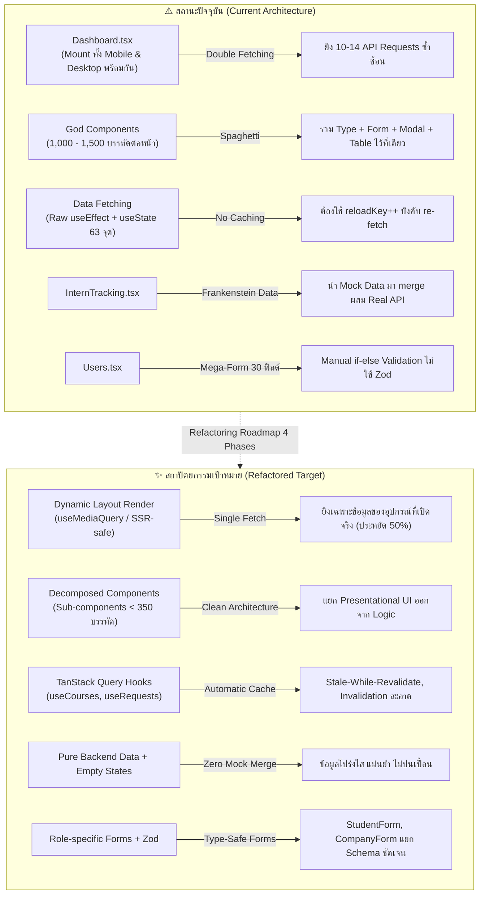
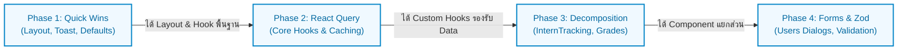

# แผนภาพรวมการปรับปรุงโครงสร้าง Frontend (Frontend Refactoring Roadmap)
## DII CAMT ShowProGroup: Architecture & State Modernization

> **ผู้จัดทำ**: ทีมสถาปัตยกรรมระบบ (Oracle & Frontend Architecture Team)  
> **อัปเดตล่าสุด**: ตุลาคม 2026  
> **เป้าหมาย**: แก้ไขปัญหา Spaghetti Code, God Components, ความซ้ำซ้อนของ Logic และยกระดับประสิทธิภาพ (Performance & Maintainability) ให้ได้มาตรฐาน Production  
> **ขอบเขต**: 4 เฟสปฏิบัติการ พร้อมเอกสารกำกับรายเฟสในไดเรกทอรี `guide/frontend/`

---

## 🧭 สารบัญและเอกสารประจำเฟส (Phase Directory)

| เฟส | ชื่อเอกสารกำกับ | ขอบเขตหลัก | ผลลัพธ์ที่คาดหวัง |
| :--- | :--- | :--- | :--- |
| **ภาพรวม** | [REFACTORING_ROADMAP_OVERVIEW.md](file:///D:/Project/dii-camt-showprogroup/guide/frontend/REFACTORING_ROADMAP_OVERVIEW.md) | บทวิเคราะห์ปัญหาภาพรวม และ Matrix ความเชื่อมโยงระหว่างเฟส | แผนที่นำทางและเกณฑ์วัดผลของทั้งโครงการ |
| **Phase 1** | [REFACTORING_PHASE_1_QUICK_WINS.md](file:///D:/Project/dii-camt-showprogroup/guide/frontend/REFACTORING_PHASE_1_QUICK_WINS.md) | **Quick Wins & Performance Fix**: ตัดปัญหา Double Mount บน Dashboard, จัดการ Toast ซ้ำซ้อน, รวมศูนย์ Constants | ลด Network Request ลง 50% ทันที, UI ไม่ถูกคลิป |
| **Phase 2** | [REFACTORING_PHASE_2_REACT_QUERY.md](file:///D:/Project/dii-camt-showprogroup/guide/frontend/REFACTORING_PHASE_2_REACT_QUERY.md) | **State Management & TanStack Query**: วางรากฐาน Query Key Factory, สร้าง Custom Hooks ให้กับ 4 หน้าหลัก (Dashboards, Courses, Requests, Internships) | เลิกใช้ `useEffect` ซ้อน, มี Client Cache, ตัด `reloadKey` |
| **Phase 3** | [REFACTORING_PHASE_3_DECOMPOSITION.md](file:///D:/Project/dii-camt-showprogroup/guide/frontend/REFACTORING_PHASE_3_DECOMPOSITION.md) | **Component Decomposition & Data Sanitization**: หั่นหน้า 1,000+ บรรทัด (InternTracking, Grades), ตัด Mock Frankenstein Data ออก 100% | โค้ดแต่ละไฟล์ไม่เกิน 400 บรรทัด, ข้อมูลจริงตรงไปตรงมา |
| **Phase 4** | [REFACTORING_PHASE_4_FORMS_VALIDATION.md](file:///D:/Project/dii-camt-showprogroup/guide/frontend/REFACTORING_PHASE_4_FORMS_VALIDATION.md) | **Forms & Type Safety with Zod**: แตก Mega-Form ในหน้า Users ออกเป็นราย Role พร้อม React Hook Form + Zod | Form State สะอาด, Type-Safe 100%, Error แจ้งตรงฟิลด์ |

---

## 📊 สถานะปัจจุบันและปัญหาที่พบ (Current State vs Target State)

---

## ⏱️ ลำดับความสัมพันธ์และการส่งต่องาน (Execution Dependency)

1. **Phase 1 ต้องทำก่อน**: เพื่อตัดปัญหา Double Mount ทันที ทำให้ Performance นิ่ง และปรับการแสดงผล Toast กับ Container ให้เป็นมาตรฐานเดียว
2. **Phase 2 สร้าง Data Layer**: วางระบบ `useQuery` และ Custom Hooks กลาง ซึ่งจะเป็นท่อส่งข้อมูลให้ Phase 3 และ 4 นำไปใช้
3. **Phase 3 แตก UI ยักษ์**: แยกไฟล์กว่า 1,500 บรรทัดออกเป็นชิ้นส่วนย่อยที่อ่านง่าย และตัด Mock Data ที่ปนเปื้อนออก
4. **Phase 4 ยกเครื่อง Form**: เปลี่ยนจากการใช้ Mega-State มาเป็น Zod Schema ทำให้ Validation แข็งแกร่งและสมบูรณ์แบบ

---

## 🎯 ตัวชี้วัดความสำเร็จของโครงการ (Key Success Metrics)

| ตัวชี้วัด | ก่อนปรับปรุง | หลังปรับปรุงครบ 4 เฟส | เครื่องมือตรวจสอบ |
| :--- | :---: | :---: | :---: |
| **API Requests เมื่อเข้า Dashboard** | 10 - 14 requests | 4 - 6 requests (-50%) | Network Tab ใน DevTools |
| **จำนวนหน้าที่ขนาดเกิน 1,000 บรรทัด** | 5 หน้า | 0 หน้า | Line count analysis script |
| **การใช้ TanStack Query ในหน้าหลัก** | 0% (0 หน้า) | 100% ใน Core Pages | Code Search `useQuery` |
| **Mock Frankenstein Data ในหน้าจริง** | มีปนใน InternTracking | 0% (ตัดทิ้งทั้งหมด) | Code Audit |
| **ความซ้ำซ้อนของ Toast Provider** | 2 ระบบ (Sonner + Radix) | 1 ระบบ (Sonner) | Bundle Analyzer / App.tsx |
| **TypeScript / Build Errors** | 0 errors | 0 errors (รักษา Build สะอาดตลอดกาล) | `npm run build && npm run typecheck` |

---

> 👉 **ขั้นตอนต่อไป**: เริ่มศึกษาและปฏิบัติตามคำแนะนำใน [REFACTORING_PHASE_1_QUICK_WINS.md](file:///D:/Project/dii-camt-showprogroup/guide/frontend/REFACTORING_PHASE_1_QUICK_WINS.md)
